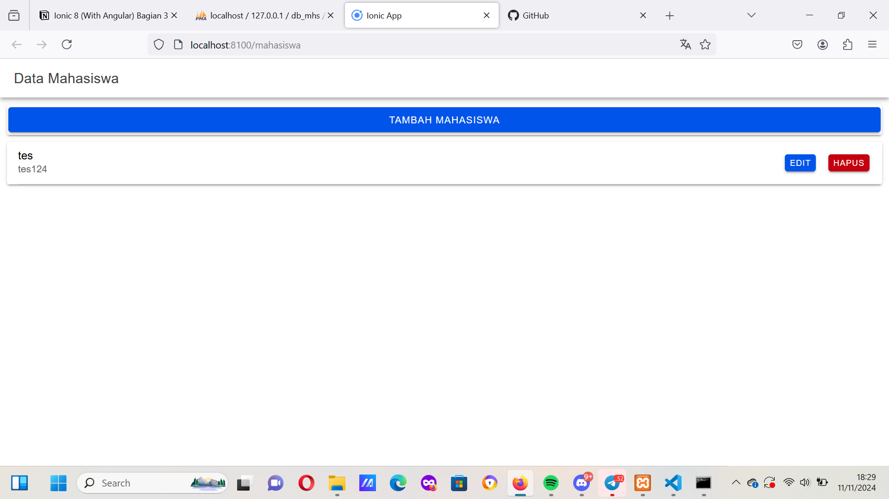
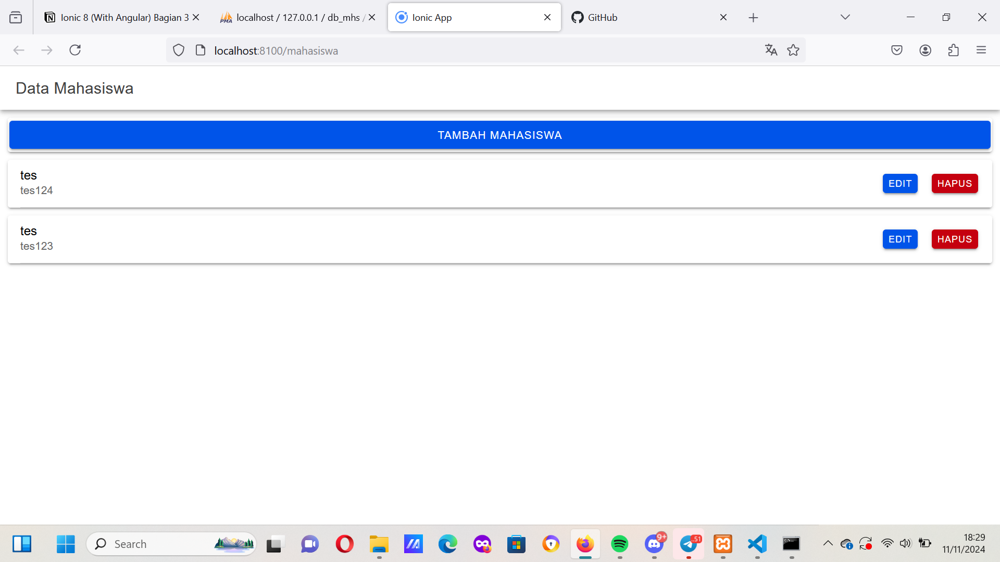
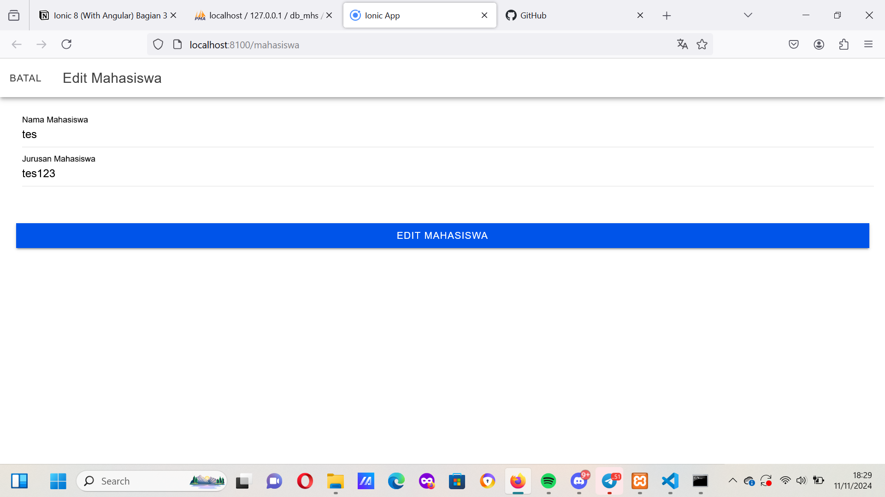
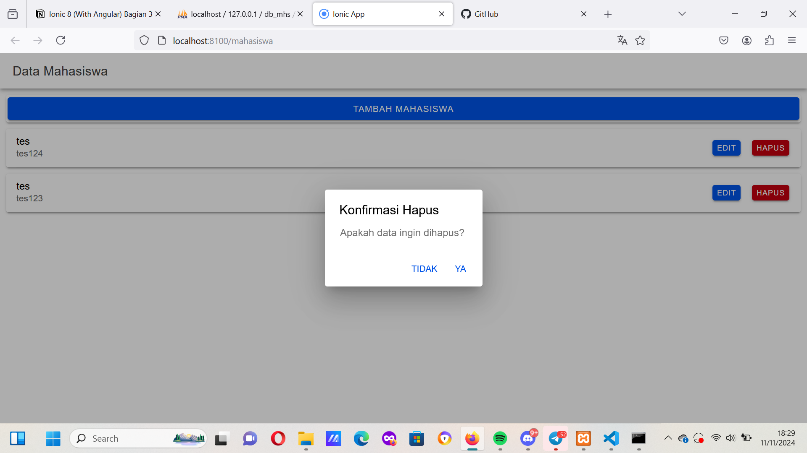

## Screenshot dan Penjelasan kode

tambahMahasiswa() {
    if (this.nama != '' && this.jurusan != '') {
      let data = {
        nama: this.nama,
        jurusan: this.jurusan,
      };
      this.api.tambah(data, 'tambah.php').subscribe({
        next: (hasil: any) => {
          this.resetModal();
          console.log('berhasil tambah mahasiswa');
          this.getMahasiswa();
          this.modalTambah = false;
          this.modal.dismiss();
        },
        error: (err: any) => {
          console.log('gagal tambah mahasiswa');
        },
      });
    } else {
      console.log('gagal tambah mahasiswa karena masih ada data yg kosong');
    }
# penjelasan
1. Pengecekan Data
- Fungsi ini pertama-tama memeriksa apakah nilai this.nama dan this.jurusan sudah terisi. Jika kedua variabel tersebut tidak kosong (this.nama != '' && this.jurusan != ''), proses penambahan data akan dilanjutkan.
- Jika ada data yang masih kosong, pesan kesalahan akan dicetak di konsol (console.log('gagal tambah mahasiswa karena masih ada data yg kosong')), dan proses penambahan data dihentikan.
2. Menyiapkan Data
Jika nama dan jurusan sudah terisi, data mahasiswa baru disusun ke dalam objek data yang berisi nama dan jurusan mahasiswa.
3. Memanggil API untuk Menambahkan Data
- Fungsi this.api.tambah(data, 'tambah.php') dipanggil dengan data dan endpoint tambah.php sebagai parameter. Fungsi ini diasumsikan mengakses endpoint API untuk menambahkan data mahasiswa baru.
    - Metode subscribe digunakan untuk menangani respons dari API:
        - Jika Berhasil (next)
            - Fungsi resetModal() dipanggil untuk mengosongkan form input setelah berhasil menambahkan data.
            - Menampilkan pesan sukses di konsol (console.log('berhasil tambah mahasiswa')).
            - Fungsi getMahasiswa() dipanggil untuk me-refresh daftar mahasiswa yang ditampilkan.
            - Variabel modalTambah diubah menjadi false, dan fungsi this.modal.dismiss() digunakan untuk menutup modal tambah mahasiswa.
        - Jika Gagal (error)
            - Pesan kesalahan dicetak di konsol (console.log('gagal tambah mahasiswa')).
              

editMahasiswa() {
    let data = {
      id: this.id,
      nama: this.nama,
      jurusan: this.jurusan,
    };
    this.api.edit(data, 'edit.php').subscribe({
      next: (hasil: any) => {
        console.log(hasil);
        this.resetModal();
        this.getMahasiswa();
        console.log('berhasil edit Mahasiswa');
        this.modalEdit = false;
        this.modal.dismiss();
      },
      error: (err: any) => {
        console.log('gagal edit Mahasiswa');
      },
    });
  }
}
1. editMahasiswa()
- Fungsi ini mengedit data mahasiswa yang ada.
- Mengumpulkan id, nama, dan jurusan ke dalam objek data, lalu mengirimkannya ke endpoint edit.php melalui api.edit().
    - Jika berhasil (next), modal edit ditutup (modalEdit = false dan this.modal.dismiss()), data di-refresh dengan getMahasiswa(), dan pesan berhasil dicetak di konsol.
    - Jika gagal (error), pesan kesalahan dicetak di konsol.

async konfirmasiHapus(id: any) {
    const alert = await this.alertController.create({
      header: 'Konfirmasi Hapus',
      message: 'Apakah data ingin dihapus?',
      buttons: [
        {
          text: 'Tidak',
          role: 'cancel',
          handler: () => {
            console.log('Hapus dibatalkan');
          },
        },
        {
          text: 'Ya',
          handler: () => {
            this.hapusMahasiswa(id);
          },
        },
      ],
    });
    await alert.present();
  }

  hapusMahasiswa(id: any) {
    this.api.hapus(id, 'hapus.php?id=').subscribe({
      next: (res: any) => {
        console.log('sukses', res);
        this.getMahasiswa();
        console.log('berhasil hapus data');
      },
      error: (error: any) => {
        console.log('gagal');
      },
    });
  }
# Penjelasan 
1. konfirmasiHapus(id: any)
   - Fungsi ini memunculkan dialog konfirmasi sebelum data mahasiswa dihapus.
   - Menggunakan alertController untuk membuat dialog konfirmasi dengan dua tombol: "Tidak" dan "Ya".
        - Jika "Tidak" dipilih, proses diakhiri tanpa melakukan apapun (console.log('Hapus dibatalkan')).
        - Jika "Ya" dipilih, fungsi hapusMahasiswa(id) dipanggil untuk melanjutkan penghapusan data mahasiswa berdasarkan id yang diberikan.

2. hapusMahasiswa(id: any)
    - Fungsi ini mengirimkan permintaan untuk menghapus data mahasiswa.
    - Memanggil api.hapus() dengan id dan endpoint hapus.php?id= sebagai parameter. Fungsi ini diasumsikan mengakses endpoint API yang bertanggung jawab untuk menghapus data.
      - Jika berhasil (next), data mahasiswa di-refresh dengan getMahasiswa(), dan pesan berhasil dicetak di konsol.
      - Jika gagal (error), pesan kesalahan dicetak di konsol.

